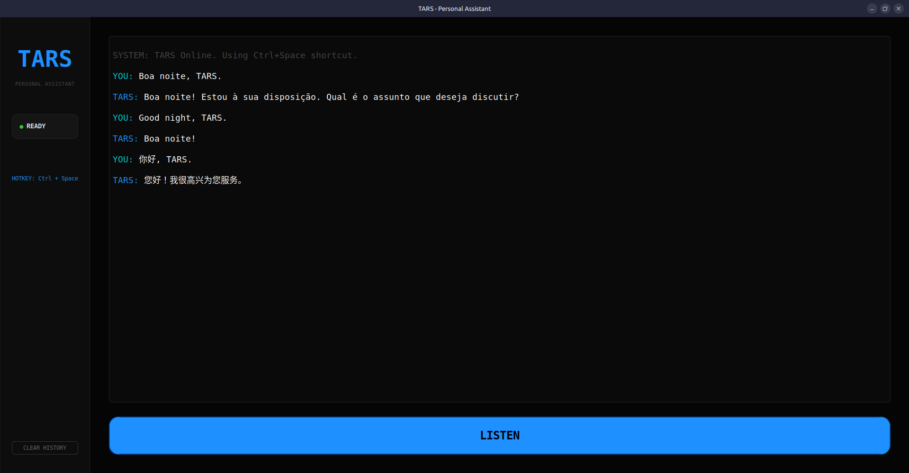

# 🤖 TARS - Autonomous Personal Assistant

[](https://linuxmint.com/)
[](https://www.python.org/)
[](https://ollama.ai/)
[](https://www.nvidia.com/)

TARS is a high-performance virtual assistant inspired by Interstellar, specifically tailored for the **Linux Mint** environment. It leverages local AI models for speech-to-text, natural language processing, and neural voice synthesis, running entirely on your local NVIDIA GPU.



---

## ✨ Core Features

- **🧠 Local Intelligence:** Integrated with **Ollama (Llama 3)** for 100% private and offline conversations.
- **🎙️ High-Fidelity Hearing:** Real-time transcription using **OpenAI Whisper (Small)**, optimized for NVIDIA CUDA cores.
- **🔊 Multilingual Neural Voice:** Realistic speech synthesis (PT-BR, EN-US, ZH-CN) via **Edge-TTS**.
- **🖥️ Linux Mint System Control:**
    - App Management: Launch VS Code, Discord, Spotify, and Terminal via voice.
    - Web Automation: Hands-free Google searches and clipboard translation.
- **📊 Smart Briefing:** Personalized morning reports including local weather (Curitiba) and real-time news via RSS.

---

## 🛠️ System Requirements

### Hardware
- **GPU:** NVIDIA GPU with CUDA support (8GB+ VRAM recommended for low latency).
- **RAM:** 16GB+.

### Software Dependencies
TARS requires specific Linux system libraries for audio and clipboard management:
```bash
sudo apt update && sudo apt install -y ffmpeg libportaudio2 xclip xsel

🚀 Quick Start

    Clone the repository:
    Bash

    git clone [https://github.com/YOUR_USERNAME/tars-assistant.git](https://github.com/YOUR_USERNAME/tars-assistant.git)
    cd tars-assistant

    Setup the environment:
    Make sure you have a Python Virtual Environment active:
    Bash

    python3 -m venv venv
    source venv/bin/activate
    pip install -r requirements.txt

    Run TARS:
    Bash

    chmod +x tars_start.sh
    ./tars_start.sh

📂 Project Structure
File	Function
tars_gui.py	Main GUI interface and event loop.
tars_utils.py	The "Engine" (Voice, AI, System Commands, Weather).
requirements.txt	Python library dependencies.
tars_start.sh	Shell script for quick startup.
.gitignore	Prevents local cache and audio files from being uploaded.
🤝 Contributing

Contributions are what make the open-source community such an amazing place to learn, inspire, and create. Any contributions you make are greatly appreciated.
